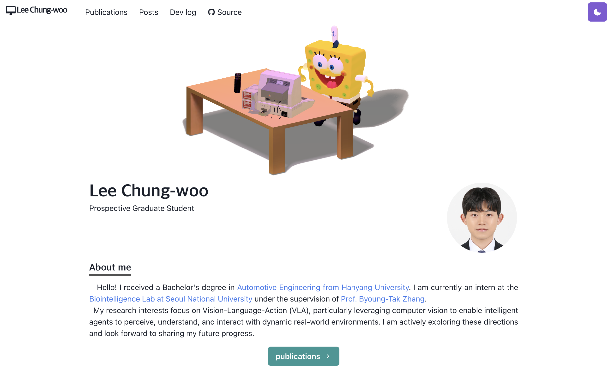

# 🌐 Personal Hompage

[🔗 Visit Live Site](https://lcwoo.github.io/homepage/)

<div align="center">



</div>

### ✨ Features

- **Interactive 3D Scene** - Animated sponge model with Three.js
- **Dark/Light Mode** - Automatic theme switching with smooth transitions
- **Fully Responsive** - Perfect experience on all devices
- **Smooth Animations** - Beautiful page transitions with Framer Motion
- **Auto-Rotation** - Interactive camera controls with orbit functionality
- **Dynamic Lighting** - Customizable spot lights for enhanced visuals

---

### 🧰 Tech Stack

- [Next.js](https://nextjs.org/) - A React framework with hybrid static & server rendering, and route pre-fetching, etc.
- [Chakra UI](https://chakra-ui.com/) - A simple, modular and accessible component library for React
- [Three.js](https://threejs.org/) - 3D library for JavaScript
- [Framer Motion](https://www.framer.com/motion/) - An animation library for React

---

### 🚀 Getting Started
#### 💻 Installation
```bash
# 1. Clone the repository
git clone https://github.com/lcwoo/homepage.git
cd homepage

# 2. Install dependencies
npm install

# 3️. Start development server
npm run dev
```

> *Open http://localhost:3000 to view your homepage!*

### 📦 Required Dependencies

```bash
# Core dependencies
npm i @chakra-ui/react @emotion/react @emotion/styled framer-motion next react react-dom

# Development dependencies  
npm i -D eslint eslint-next prettier

```

---

## Project structure

```bash
📂 homepage/
├── pages/               # Next.js pages (routes)
│   ├── index.js         # 🏠 Homepage with 3D scene and profile
│   ├── publications.js  # 📚 Publications
│   ├── _app.js          # App-level config
│   └── _document.js     # HTML structure
│
├── components/          # UI components
│   ├── layouts/
│   ├── bio.js
│   ├── paragraph.js
│   ├── section.js
│   ├── grid-item.js
│   └── scene-loader.js
│
├── lib/                 # Utilities and configs
│   ├── theme.js         # Chakra theme overrides
│   ├── model.js         # GLB loader
│   └── constants.js
│
└── public/              # Static assets
    ├── images/          # Preview/profile images
    └── sponge-webp.glb  # 🧽 3D model

```

---

### 🛠 Customization Guide
- #### 👤 Personal Info (pages/index.js)

```javascript
// Profile Section
<Heading as="h2" variant="page-title">
  Your Name
</Heading>
<p>Your Title/Position</p>

// About Section
<Paragraph>
  Your bio and description here...
</Paragraph>

// Social Links
<Link href="https://github.com/yourusername">
  <Button leftIcon={<IoLogoGithub />}>
    GitHub
  </Button>
</Link>
```

- #### 🎨 Theme Settings (lib/theme.js)

```
const colors = {
  grassTeal: '#88ccca',    // Custom brand color
  // Add your custom colors
}

const config = {
  initialColorMode: 'dark',  // 'light' or 'dark'
  useSystemColorMode: true   // Auto-detect system preference
}
```

- #### 🧩 Replace 3D Model

1. Add your GLB/GLTF file to public/ directory
2. Update the model path in pages/index.js:

```javascript
useEffect(() => {
  setScenePath(`${router.basePath}/your-model.glb`)
}, [router.basePath])
```

3. Adjust lighting and camera in the scene component as needed

- #### 🎯 Scene Configuration
Customize the 3D scene settings:

```javascript
// Camera positioning
const initialCameraPosition = new THREE.Vector3(
  20 * Math.sin(0.2 * Math.PI),
  10,
  20 * Math.cos(0.2 * Math.PI)
)

// Lighting setup
const spotLight1 = new THREE.SpotLight(0xffaa33, 700)  // Color & intensity
spotLight1.position.set(8, 20, 8)                     // Position
```

---
## 🔧 Development

- #### ➕ Adding New Sections

Create new sections using the Section component:
```javascript
import Section from '../components/section'

<Section delay={0.3}>
  <Heading as="h3" variant="section-title">
    New Section
  </Heading>
  <Paragraph>
    Your content here...
  </Paragraph>
</Section>
```

---

## 📄 License & Usage

<div align="center">
  
</div>


You can create your own homepage for free without notifying me by forking this project under the following conditions:

- Add a link to [my homepage](https://lcwoo.github.io/homepage/), and [Takuya's wensite](https://www.craftz.dog/)
- Do not use the 3d model

Check out [LICENSE](./LICENSE) for more detail.

---

## 🙏 Acknowledgement


This website is built based on the [Takuya's website](https://www.craftz.dog/). Highly appreciate his great work! 🎉 Special thanks to the open-source community for the amazing tools and libraries!

<div align="center"> Made with ❤️ by lcwoo If you found this helpful, please ⭐ the repository! </div>